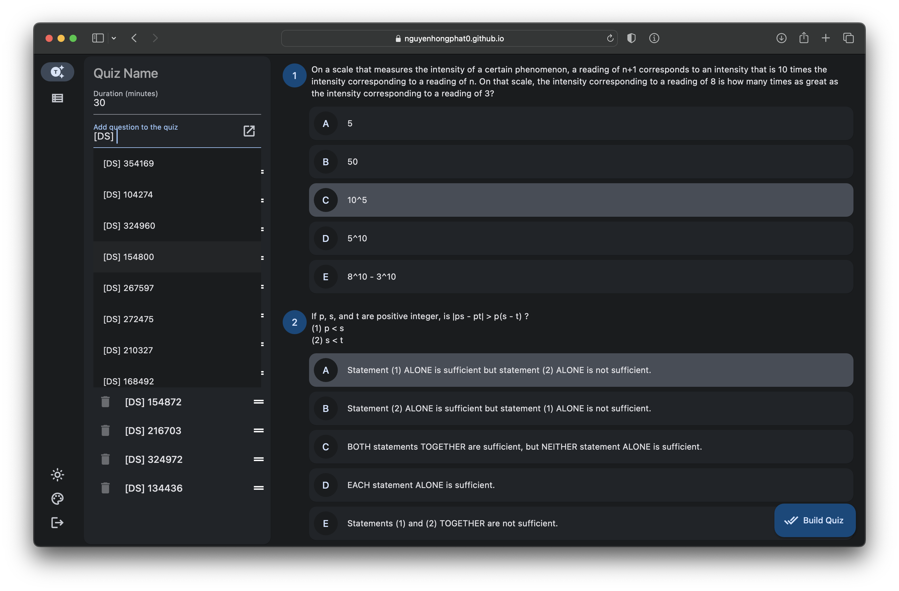
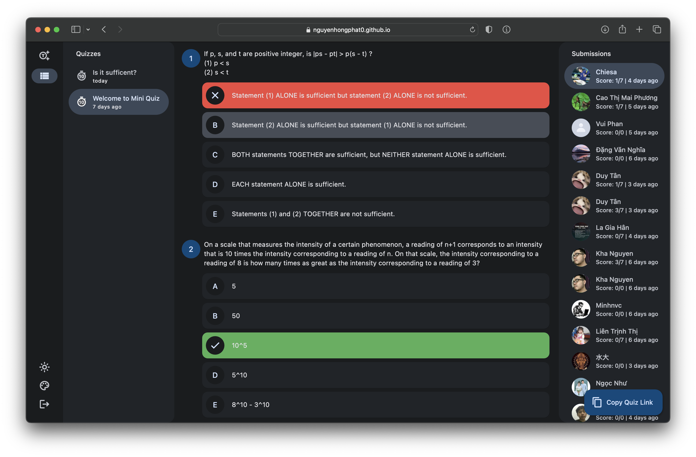

# Mini Quiz Creator

This app allows users to create GMAT tests and view submissions.

## Preview




## Features

### Create GMAT Tests

Users can create GMAT tests by selecting questions from the database. The app supports five different types of questions: Quantitative Comparison, Data Sufficiency, Problem Solving, Sentence Correction, and Critical Reasoning. Users can select the question type they want to include in their test and filter the questions based on their difficulty level. They can also set the time limit for the test and choose the number of questions to include.

### View Submissions

Users can view their test submissions and check their scores. The app provides a detailed report of the user's performance, including the number of correct and incorrect answers and the time taken to complete the test.

## Usage

1. Clone the repository
2. Install Flutter by following the official documentation for your platform: https://flutter.dev/docs/get-started/install
3. Build and run the app by following the official documentation for your platform: https://flutter.dev/multi-platform

Example for running the app on Android:

```bash
flutter run -d <device-id>
```

Replace <device-id> with the ID of the connected Android device or emulator. You can find the ID by running `flutter devices`.

# License

This project is licensed under the MIT License.
